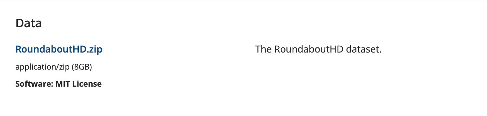

# Multi-Camera Vehicle Tracking & AI Video Investigation

This project implements a **multi-camera vehicle tracking and analytics system** with an **AI interface** that allows users to query surveillance footage using natural language.

The system combines:

- Multi-camera vehicle tracking
- Digital fence / gate analytics
- LLM reasoning (Ollama)
- Vision-Language Models (VLMs) for visual understanding
- Automated video clip generation

---

## Example Frame Analysis

Below is a sample frame from where you can download the dataset

Example VLM question: